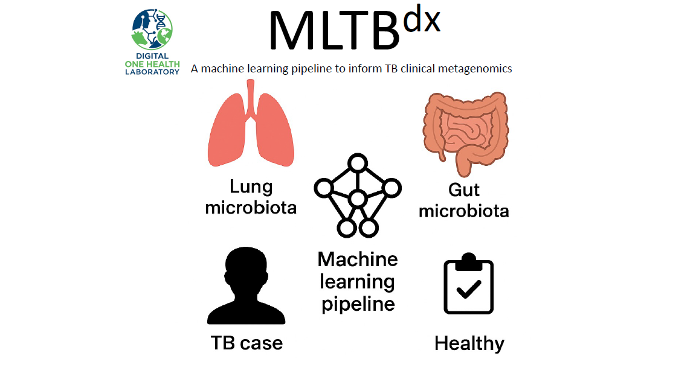

 
#  MLTBdx pipeline

MLTBdx is a reproducible Nextflow (DSL2) pipeline designed to classify tuberculosis (TB) disease  and treatment status using a modified implementation of SIAMCAT. The pipeline also ranks microbiota features of importance at the genus level, enabling identification of taxa that influence classification performance. From these, potential functional roles in disease onset, progression, and recovery can be inferred.
MLTBdx employs two key optimization steps:
  * The normalization method
  * The genus prevalence threshold (as described in **[SIAMCAT](https://siamcat.embl.de/index.html)**).

It systematically explores this parameter space to rank the best-performing model based on conventional machine learning metrics such as Matthews Correlation Coefficient (MCC). For interpretability, SHapley Additive exPlanations (**[SHAP](https://shap.readthedocs.io/en/latest/)**) are incorporated. Approximately 156 models are trained and evaluated to generate a comprehensive dataset from which the top-ranked model is selected.
This represents the first microbial-informed machine learning pipeline developed to harness clinical metagenomics for TB diagnosis and potentially prognosis. We acknowledge that this is an early-stage proof of concept and should be interpreted as a foundational step toward this broader goal.

# Features
* End-to-end: preprocessing -> Feature Filtering -> Model training/evaluation -> best/top 2 selection -> external validation -> SHAP plots. 
* Reproducible via Conda/Mamba or containers
* Simple inputs: a features CSV (taxa Samples) and a Meta CSV (Samples * covariates)
* Friendly models: ridge, ridge_ll, lasso, lasso_ll, enet, rf
* Config-first: defaults live in **nextflow.config**

# Requirements
  - Nextflow (DSL2)
  - One of: 
         * Conda/Mamba (recommended)
         

# Inputs
1. **Features CSV**
  - Columns One taxa column / index ( default Genus)+ samples for each taxa and corresponding abundance values. 
  - The abundance values are numeric

    |Genus	|SRR12965233 |SRR14508216 |SRR14508069 |SRR11280380 |
    |:-------|:-------|:-------|:-------|:-------|
    |Abiotrophia	|0	|0	|0	|0 |
    |Absconditabacteriales_(SR1) |0.266667 |0 |0 |0 |
    |Acholeplasma	|0 |0 |0 |0 |
    |Acidaminococcus |31.846154 |0 |0 |0 |

2. **Meta CSV**
  - Must contain **sample IDs** that map to samples in the features file 
  - Must contain the label columns (dependant variable) default is **Disease Status** and case label e.g., **TB_case**.
  - Example header:
  The pipeline aligns feature columns with meta rownames(from **--meta_id_col**)
    |SampleID	|Body_Site	|diversity_shannon	|Incidence	|Density	|Disease_Status|
    |:-------|:-------|:-------|:-------|:-------|:-------|
    |SRR12965233	|Lung	|3.818649	|0.00468	|40.6	|TB_case|
    |SRR14508216	|Lung	|3.82213	|0.00222	|80	|TB_case|
    |SRR14508069	|Lung	|3.164045	|0.00222	|80	|TB_case|
    |SRR11280380	|Lung	|2.164355	|0.00196	|201	|TB_case|
    |SRR12964947	|Lung	|4.305716	|0.00468	|40.6	|healthy_individual|
    

# Process overview

### PREPARE_DATA
Reads Features & Meta, uses --taxa_col and --meta_id_col, aligns samples, normalizes to relative abundances, saves base/sc_base.rds.

### FLT_SPLIT
Applies normalization and cutoff; produces split RDS and QC PDFs.

### TRAIN_EVAL
Trains each model (ridge|lasso|enet|rf → internally ridge_ll|lasso_ll|enet_ll|randomForest), evaluates, outputs per-model CSVs and model_*.rds.

### FINALIZE_RESULTS
Merges AUROC and performance CSVs and plots AUROC curves.

### WRITE_MODEL_MAP
Emits model_map_<model_id>.tsv mapping model_id → absolute path to published model_*.rds.

### SELECT_TOP1_BY_METRIC / SELECT_TOP2_BY_METRIC
Picks best / top-2 by params.sel_metric (fallback to AUROC if missing).

### VALIDATE_BEST
Loads the best model and evaluates it on the validation set.

### SHAP_FROM_SIAMCAT_TOP2
Produces SHAP summaries/metrics for the top-2 models.

# Quickstart
## update the nextflow.config file 
Update the files to match the input files Data, models, normalization parameters. 
Evaluation Parameters
  - 'acc' = Accuracy
  - 'sens' = Sensitivity
  - 'spec' = Specificity 
  - 'precision' = Precision
  - 'f1' = F1 Score
  - 'kappa' = Cohen's Kappa
  - 'mcc' = Mathews Correlation Coefficient

          params {
          // choose  conda
          useConda = true
          // nextflow.config

          // core inputs
          features = 'data/Features_Sample.csv'
          meta     = 'data/Metadata_Sample.csv'
          outdir   = '../NextflowResults/results_sampletestIntEval'

          // modeling grid
          //'rank.unit,rank.std,log.std,log.unit,log.clr,std'
          norms   = 'rank.unit,rank.std,log.std,log.unit,log.clr,std'
          cutoffs = '0.005,0.0001,0.0005,0.01'
          models  = 'randomForest,lasso,lasso_ll,enet,ridge,ridge_ll'
          //models = 'ridge'
          // selection metric
          sel_metric = 'mcc'

          // labels / IDs
          label_column = 'Disease_Status'   // prefer this key
          case_label   = 'TB_case'
          taxa_col     = 'Genus'
          meta_id_col  = 'SampleID'
          meta_ids_are_colnames = false

          // SHAP
          shap_nsim   = 100
          shap_sample = 200
          shap_mtry   = 18
          shap_trees  = 1000
          shap_alpha  = 0.5
          shap_thresh = 0.5

          // validation inputs (optional; can be null if unused)
          val_features    = 'data/Validation_Features_Sample.csv'
          val_meta        = 'data/Validation_Metadata_Sample.csv'
          label_col       = 'Disease_Status'   // keep ONLY if some code explicitly expects this name
          val_feat_id_col = 'Genus'
          }

        process {
          cpus = 16
          memory = '32 GB'
          errorStrategy = 'retry'
          maxRetries = 1
        //  scratch = true
        }

        profiles {
          docker {
            docker.enabled = true
          }
          conda {
                process {
              // make all processes use this env by default
              conda = 'envs/r-siamcat.yml'
            }
            conda.enabled = true
          }
        }

        timeline {
          enabled = true
          overwrite = true
          file = "${params.outdir}/timeline.html"
        }

        trace {
          enabled = true
          overwrite = true
          file = "${params.outdir}/trace.txt"
        }

        report {
          enabled = true
          overwrite = true
          file = "${params.outdir}/report.html"
        }

## Use defaults from nextflow.config:
    nextflow run main.nf \
     -profile conda \
     -bg -name run_siamcat \ # update the name accordingly. 

## Overide anything at runtime: 
    nextflow run main.nf \
        --features data/Features.csv \
        --meta data/Meta.csv \
        --outdir NextflowResults/run1 \
        --taxa_col Genus \
        --meta_id_col SampleID \
        --label_column Disease_Status \
        --case_label TB_case \
        --norms 'log.std,rank.unit' \
        --cutoffs '0.005,0.01' \
        --models 'ridge,lasso,enet' \
        --sel_metric mcc \
        --shap_nsim 100 --shap_sample 200

# Reference

  Wirbel, J., Zych, K., Essex, M. et al. Microbiome meta-analysis
  and cross-disease comparison enabled by the SIAMCAT machine
  learning toolbox. Genome Biol 22, 93 (2021).
  https://doi.org/10.1186/s13059-021-02306-1
